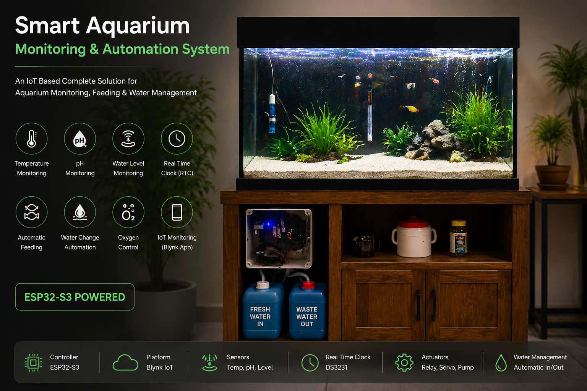
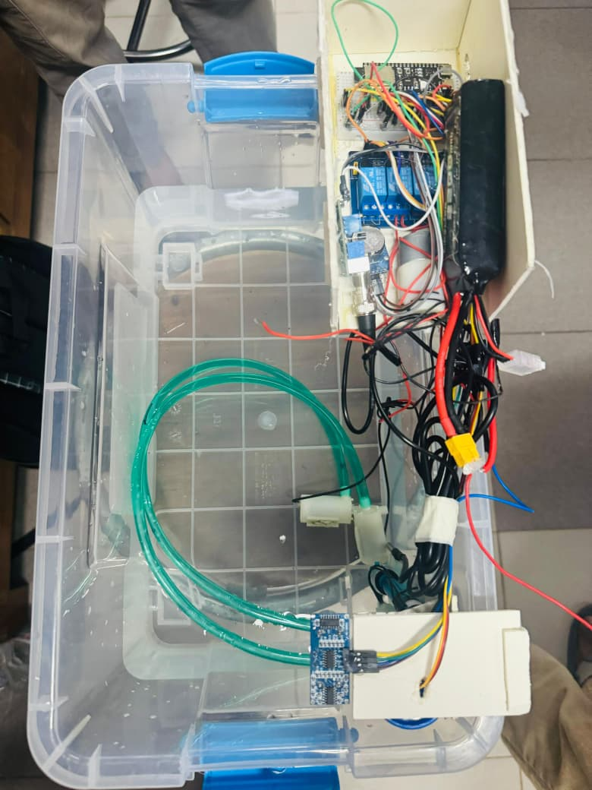
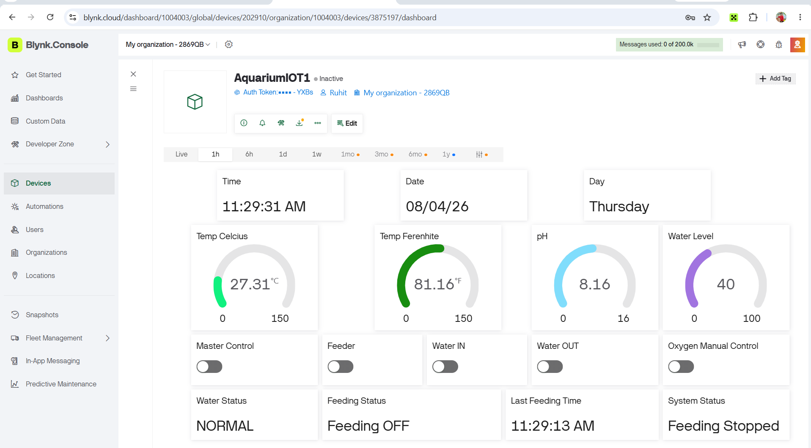
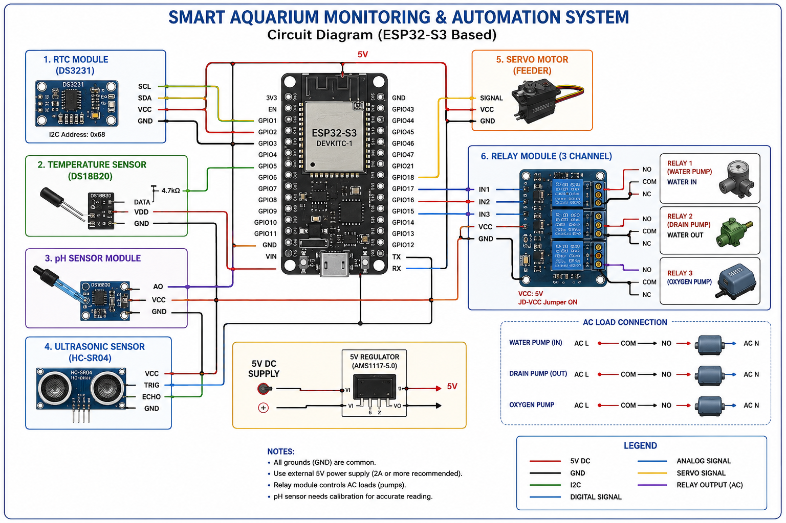

<div align="center">

# 🐠 Smart Aquarium Monitoring & Automation System

### ESP32-S3 Based IoT Aquarium System

An IoT-based Smart Aquarium system that automatically monitors water conditions and controls fish feeding, water level, and oxygen supply using **ESP32-S3** and **Blynk Cloud**.




</div>

---

# 📖 Project Overview

This project is an ESP32-S3 based Smart Aquarium Monitoring and Automation System designed to reduce manual maintenance and improve fish health.

The system continuously monitors:

- 🌡 Water Temperature
- 💧 Water Level
- ⚗ pH Value
- 🕒 Real Time Clock

Based on these measurements, the controller automatically performs:

- Automatic Fish Feeding
- Automatic Water Refill
- Water Drain Control
- Oxygen Pump Control

The complete system can also be monitored and controlled remotely through the **Blynk IoT Cloud Platform**.

---

# ✨ Key Features

- 🐟 Automatic Fish Feeding
- 🌡 Temperature Monitoring
- ⚗ pH Monitoring
- 💧 Water Level Detection
- 🚰 Automatic Water Refill
- ♻ Water Drain Control
- 💨 Oxygen Pump Control
- 🕒 RTC Based Feeding Schedule
- 📱 Blynk Mobile Dashboard
- 📡 WiFi Remote Monitoring
- 🔄 Manual & Automatic Mode

---

# 🛠 Hardware Components

| Component | Purpose |
|-----------|----------|
| ESP32-S3 | Main Controller |
| DS18B20 | Temperature Sensor |
| DS3231 RTC | Time Scheduling |
| pH Sensor | Water Quality |
| HC-SR04 | Water Level Detection |
| Servo Motor | Fish Feeding |
| Relay Module | Pump Control |
| Water Pump | Water Refill |
| Oxygen Pump | Oxygen Supply |

---

# 💻 Software Used

- Arduino IDE
- Embedded C++
- Blynk IoT
- ESP32 Board Package

---

# 📷 Project Prototype

<p align="center">

</p>

---

# 📱 Blynk Dashboard

<p align="center">

</p>

---

# 📊 System Block Diagram

<p align="center">

</p>

---

# ⚡ Circuit Diagram

<p align="center">

</p>

---

# ⚙ System Workflow

```text
Power ON
      │
      ▼
Initialize ESP32-S3
      │
      ▼
Read Sensors
      │
      ├── Temperature
      ├── pH
      ├── Water Level
      └── RTC
      │
      ▼
Decision Making
      │
      ├── Feed Fish
      ├── Water Pump
      ├── Oxygen Pump
      └── Water Drain
      │
      ▼
Update Blynk Dashboard
      │
      ▼
Repeat
```

---

# 📂 Repository Structure

```text
Smart-Aquarium-IoT-System
│
├── README.md
├── LICENSE
│
├── images
│   ├── cover.png
│   ├── prototype.jpeg
│   ├── dashboard.png
│   ├── block-diagram.png
│   └── circuit-diagram.png
│
└── src
    └── Smart_Aquarium.ino
```

---
# 📈 Results

✔ Automatic fish feeding every 4 hours

✔ Real-time temperature monitoring

✔ Water level monitoring

✔ pH monitoring

✔ Automatic water refill

✔ Oxygen pump automation

✔ Blynk IoT remote monitoring

# 🚀 Future Improvements

- PCB Design
- Mobile Application
- Cloud Data Logging
- AI-Based Fish Health Detection
- Water Quality Prediction
- Push Notifications
- OTA Firmware Update

---

# 👨‍💻 Author

**Ruhit Mondal**

B.Sc. in Electrical & Electronic Engineering (EEE)

Ahsanullah University of Science and Technology (AUST)

📍 Bangladesh

---

# ⭐ If you like this project

Please consider giving this repository a **Star ⭐**.
